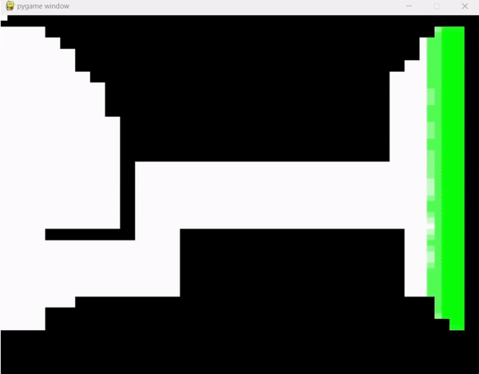
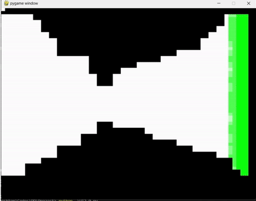

# 🌃 Nightmarket Simulator

**Simulating and analyzing human flow in crowded spaces using GPU acceleration and visualization tools.**

### 🖼️ Simulation Demos

| **Bending Road Simulation** | **Tunnel Simulation** |
|-----------------------------|-----------------------|
|  |  |

---

## 🚀 Introduction

In bustling events like night markets or New Year's Eve celebrations, poorly designed streets can lead to severe congestion. The **Nightmarket Simulator** is a cutting-edge tool to evaluate and visualize pedestrian flow under various street layouts, aiming to enhance crowd management strategies.

### 🎯 Objective
- **Optimize Street Designs**: Simulate human traffic flow to identify bottlenecks and improve layouts.
- **Leverage GPU Power**: Achieve real-time, efficient simulations using parallel computing.

---

## 🛠️ Key Features

- **🚀 GPU-Accelerated Simulation**: Harness the power of parallel processing for large-scale pedestrian simulations.
- **🎛️ Configurable Preferences**: Tailor pedestrian behaviors, such as directional tendencies (e.g., 80% probability of moving right).
- **🤝 Collision Resolution**: Smart algorithms ensure realistic pedestrian interactions.
- **📊 Visualization Pipeline**: Intuitive visual outputs for analyzing simulation phases and density.

---

## ⚙️ How It Works

### Simulation Flow:

1. **🔄 Initialization**:
   - Randomly position pedestrians at starting points.

2. **🧭 Decision Phase**:
   - Pedestrians decide their next move based on directional preferences.

3. **🚶 Movement Phase**:
   - Pedestrians attempt to move to their chosen positions.

4. **⚠️ Conflict Check**:
   - Resolve conflicts where multiple pedestrians aim for the same spot.

5. **📂 Output Generation**:
   - Periodically save simulation results as binary pedestrian maps.

### Technical Implementation:

- **CUDA Parallelism**: Efficiently simulate thousands of pedestrians.
- **GPU Memory Management**: Store and update pedestrian positions in global memory.
- **Python Visualization**: Analyze results with custom scripts.

---

## 🖥️ Visualization and Analysis

- **Heatmaps**: Visualize pedestrian density and flow.
- **Phase Analysis**: Track pedestrian movements across simulation phases.
- **Throughput Metrics**: Measure the efficiency of pedestrian exits.

---

## 📈 Performance Insights

- **Scalability**: Smooth performance with increasing pedestrian counts.
- **Efficiency**: Simulate thousands of pedestrians with minimal overhead.
- **Limitations**: Larger maps (2048+) may face GPU resource constraints.

---

## 🚧 Challenges and Solutions

| **Challenge**                          | **Solution**                                      |
|----------------------------------------|--------------------------------------------------|
| Pedestrian collisions at the same spot | Introduce directional buffers for smoother flow. |
| Infinite conflict loops                | Predefine moves to avoid recursive conflicts.    |
| Turning direction ambiguity            | Use predefined turn sections for clarity.        |

---

## 📝 Future Work

- **Scaling Up**: Optimize for even larger simulations.
- **Enhanced Visualization**: Develop real-time, interactive visual tools.

---

Thank you for exploring the **Nightmarket Simulator**! We welcome your feedback and inquiries. 🌟
